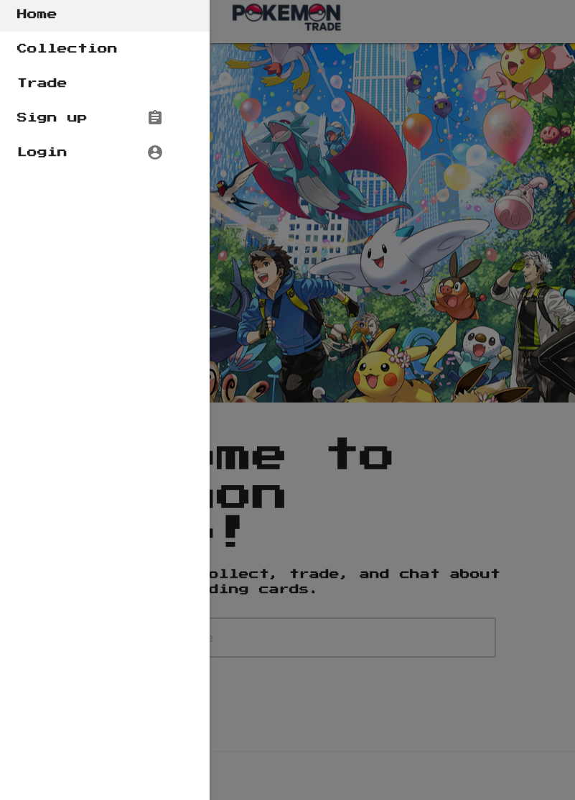
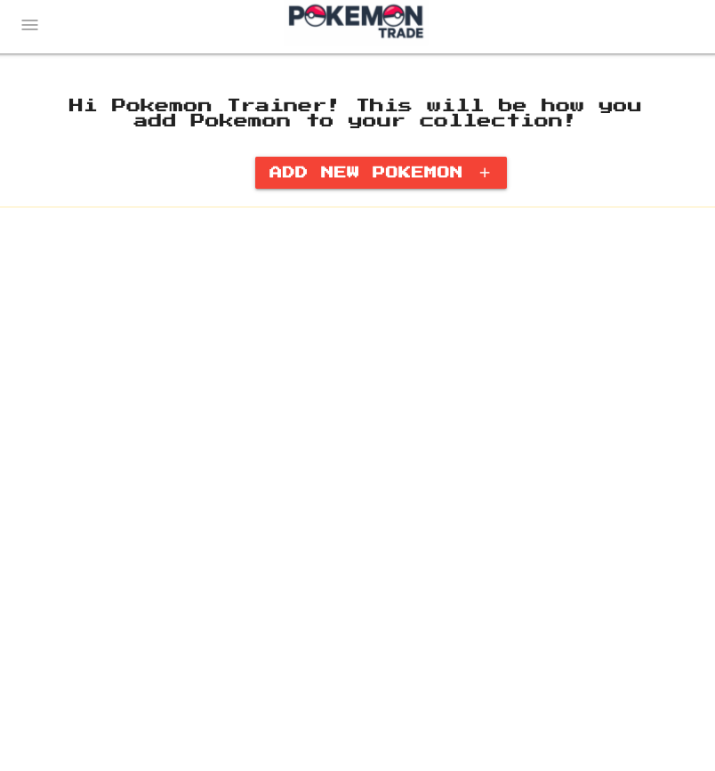
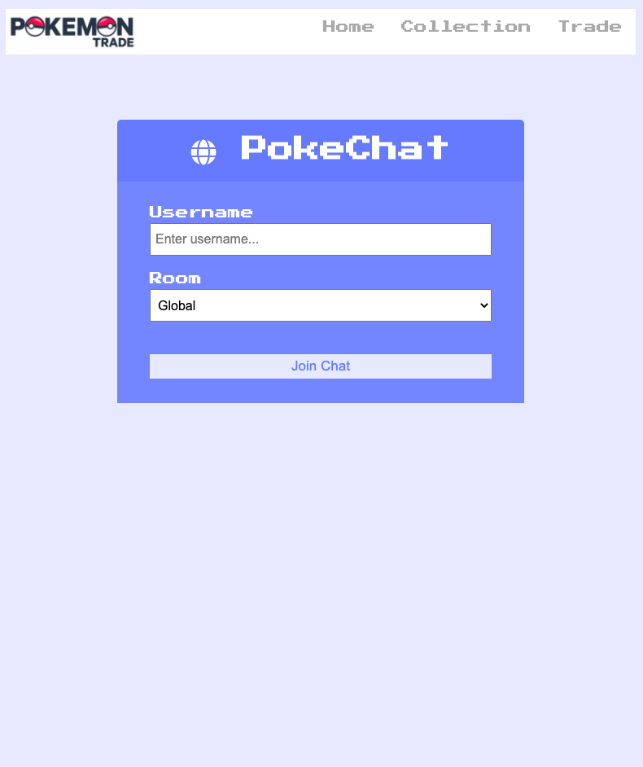
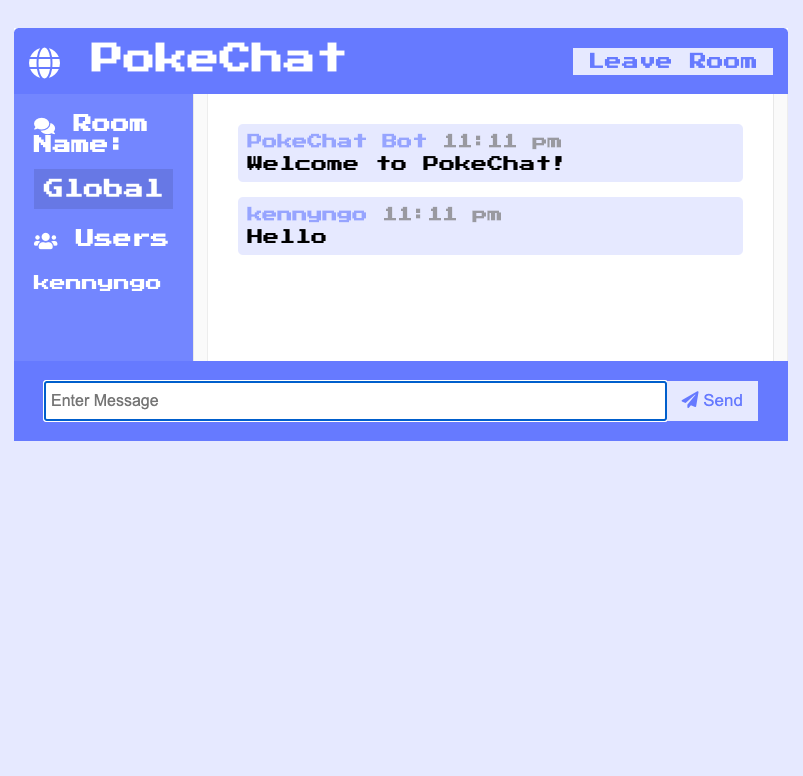

# Pokemon Trading Site

Pokemon site to keep track of your Pokemon and chat with other Poke-Masters.

## Description

An application that allows on to keep track of their Pokemon via a Pokemon API. In addition, one would be able to chat with others in a chatroom. The site is styled using Materialize as well as Ness.css to bring back that retro Pokemon theme. 

## Installation

Use the node package manager (npm) [npm](https://www.npmjs.com/)

```
npm install
```

[Pokemon Trading Heroku Deployment](https://pokemon-trade-heroku.herokuapp.com/)

## Visuals 

Pokemon Home 





## Roadmap

- Stylize the Pokemon center better (ex. home page)
- Including a MongoDB database rather than MySQL so we could utilize Mongo Atlas
- Actuating the 'Trade' function

## Acknowledgement

- [Bhagyashree](https://github.com/Bhagyashree9402)

## Project Status

Our group generated an MVP with simple functions of being able to signup/login, chat, log your Pokemon, but not yet actuated the Trade function. 